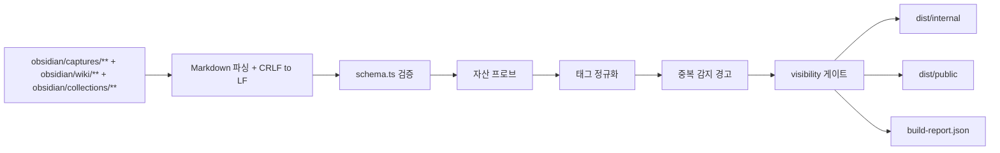

# Phase 2 — Build Pipeline

목표: Obsidian Markdown과 자산을 읽어 결정적인 JSON과 정적 자산 번들을 만든다. 빌드 실행은 자동화하지 않고 사람이 작업창에서 명령으로 실행한다.

참조 결정: `D-01`, `D-03`, `D-06`, `D-07`, `D-10`, `D-11`, `D-15`, `D-16`, `D-17`

## 빌드 흐름

## 작업 계획

| 작업 | 계획 | 검증 |
|---|---|---|
| Markdown 읽기 | 파일 내용을 읽은 직후 CRLF를 LF로 정규화한다. 정렬 순서와 JSON 키 순서를 고정한다. | 같은 노트를 CRLF와 LF로 각각 저장한 뒤 빌드해도 `shasum dist/internal/data/index.json` 값이 같아야 한다. |
| Frontmatter 파싱 | 캡처, wiki, 컬렉션 Markdown을 구조화하고, 본문은 상세와 wiki 페이지용 콘텐츠로 보존한다. | 유효한 샘플 노트는 `index.json`에 slug, frontmatter 필드, 본문 경로 또는 본문 데이터가 일관된 키 순서로 나온다. |
| Wiki 인덱스 검증 | `obsidian/wiki/index.md`가 모든 wiki 페이지를 링크하는지 확인한다. `obsidian/wiki/log.md`는 로그 형식만 검증하고 본문을 재작성하지 않는다. | wiki 페이지를 하나 추가하고 index 링크를 빼면 `npm run validate`가 실패해야 한다. 로그 형식이 틀리면 파일 경로와 줄 번호를 출력해야 한다. |
| 자산 프로브 | 스틸은 치수, 포맷, 바이트, 해시를 파일에서 계산한다. 모션은 포맷, 바이트, 해시, 재생 시간, 프레임 수를 계산하고 대표 프레임을 만든다. | 스틸 샘플의 치수는 독립 도구 결과와 일치해야 한다. 모션 샘플의 프레임 수와 재생 시간은 `ffprobe` 결과와 일치해야 한다. |
| 포스터 프레임 | GIF/MP4/WebM에 한해 갤러리용 poster 이미지를 파생한다. 정지 이미지는 별도 썸네일을 만들지 않는다. | 빌드 후 모션 항목에는 poster 경로가 있고, 정지 항목에는 poster 파생물이 없어야 한다. |
| 태그 정규화 | `src/shared/vocabulary.ts`의 동의어 사전 기준으로 태그를 정규화한다. 원본 태그와 정규 태그를 리포트에 함께 남긴다. | 동의어 태그를 넣으면 `index.json`에는 정규 태그가 들어가고, 리포트에는 변환 건수와 원본 값이 출력되어야 한다. |
| 중복 감지 | 파일 해시가 같은 캡처는 실패가 아니라 경고로 보고한다. | 같은 파일을 두 캡처에 넣으면 빌드는 성공하되 `build-report.json`에 중복 그룹과 파일 경로가 표시되어야 한다. |
| visibility 게이트 | `internal` 빌드는 전체를 포함하고, `public` 빌드는 public 항목만 포함한다. internal 자산은 public 폴더로 복사하지 않는다. | `npm run build -- --target=public` 후 `rg -l '<internal-sample-slug>' dist/public` 결과가 0건이어야 한다. internal 전용 자산 파일도 없어야 한다. |
| Wiki visibility 전파 | internal 캡처만 참조하는 wiki 페이지는 public 번들에서 제외한다. public과 internal을 함께 참조하는 wiki 페이지는 public 빌드에서 internal 참조를 제거하지 않고 빌드 실패로 처리한다. | public 빌드에서 internal slug를 참조하는 wiki 페이지가 있으면 파일 경로와 참조 slug를 출력하고 실패해야 한다. |
| 빌드 리포트 | 총 캡처 수, 포함 수, 제외 수, 실패 수, 기본값 적용 수, 태그 정규화 수, 중복 수, 총 자산 바이트, 1GB 대비 잔여, 100MB 초과 파일을 출력한다. | 의도적으로 깨진 노트 1건과 100MB 초과 더미 1건을 넣으면 리포트에 개수, 사유, 파일명이 나타나야 한다. 실패 항목이 있으면 exit 1이어야 한다. |
| 산출물 결정성 | 같은 입력에서 같은 JSON을 만든다. 날짜나 절대 경로처럼 실행 환경별로 달라지는 값을 JSON에 넣지 않는다. | `npm run build -- --target=internal`을 연속 2회 실행한 뒤 `shasum dist/internal/data/index.json` 값이 같아야 한다. |

## 사용자에게 반드시 알려야 하는 리포트 항목

빌드는 성공하더라도 아래 항목은 콘솔과 `build-report.json`에 표시한다.

- public 빌드에서 visibility 때문에 제외된 캡처 수
- public 빌드에서 제외된 wiki 페이지 수와 사유
- public 빌드에서 internal 캡처를 참조해 실패한 wiki 페이지 수
- public 빌드에서 복사되지 않은 자산 수와 총 바이트
- 태그 정규화 적용 수와 원본 태그 목록
- 중복 해시 그룹 수
- Git 단일 파일 100MB 초과 파일 목록
- GitHub Pages 게시 사이트 1GB 대비 현재 자산 총량과 잔여량
- 파생 실패 항목 수와 실패 이유

## 사용자 확인 필요

| 항목 | 이유 |
|---|---|
| `ffmpeg`/`ffprobe` 설치 방식 | 시스템 설치를 요구할지, npm 패키지로 포함할지 결정해야 한다. npm 바이너리는 편하지만 리포와 설치 크기를 늘릴 수 있다. |
| `dist/` 커밋 여부 | 배포 방식과 파생 산출물 누락 검증 방식이 달라진다. |

## 통과 기준

- 빌드 결과는 같은 입력에서 바이트 단위로 재현된다.
- public 번들에 internal 메타와 자산이 남지 않는다.
- public 번들에 internal 캡처를 참조하는 wiki 페이지가 남지 않는다.
- 파생 가능한 값은 Markdown에서 읽지 않고 파일에서 계산한다.
- 상한, 샘플링, 제외, 실패는 조용히 넘어가지 않고 개수와 이유를 출력한다.
