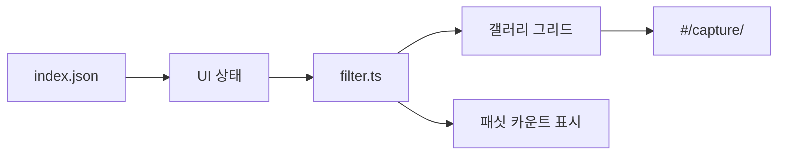

# Phase 3 — UI Shell And Gallery

목표: 빌드된 JSON을 읽기만 하는 정적 UI 셸과 갤러리 검색 화면을 만든다. UI는 Markdown이나 원본 볼트를 직접 읽지 않는다.

참조 결정: `D-01`, `D-04`, `D-09`, `D-12`, `D-13`, `D-14`

## 작업 계획

| 작업 | 계획 | 검증 |
|---|---|---|
| 앱 셸 | Vite의 정적 진입점에서 `dist/<target>/data/index.json`을 읽는 구조로 만든다. 상단 네비는 80px, Canvas 배경, 1px hairline을 사용한다. | 네트워크 탭에서 앱이 JSON과 정적 자산만 요청해야 한다. Markdown 파일 요청이 없어야 한다. |
| 해시 라우터 | GitHub Pages base path 제약을 피하기 위해 `#/`, `#/capture/<slug>`, `#/collections`, `#/stats`, `#/export` 형식으로 라우팅한다. | 새로고침해도 404가 나지 않아야 한다. 임의 base path에서 해시 URL이 동작해야 한다. |
| 데이터 로딩 상태 | 로딩, 빈 상태, 오류 상태를 둔다. 빈 상태는 일러스트 없이 큰 활자와 색면으로 표현한다. | JSON 경로를 일부러 깨면 오류 상태가 보이고, 데이터 0건 샘플에서는 빈 상태가 보여야 한다. |
| 갤러리 그리드 | 데스크톱 3-up, 태블릿 2-up, 모바일 1-up 그리드. 카드 radius는 28px, 스틸은 원본 이미지, 모션은 poster 이미지를 사용한다. | 1440px, 900px, 375px 뷰포트에서 각각 3/2/1 컬럼이어야 한다. 모션 항목은 poster가 보여야 한다. |
| 필터 모듈 공유 | `src/shared/filter.ts`에 텍스트 검색과 패싯 필터 규칙을 둔다. 빌드는 같은 규칙으로 패싯 카운트를 만들고 UI는 같은 규칙으로 결과를 필터한다. | 필터 조합별 UI 결과 수가 빌드된 패싯 카운트와 일치해야 한다. 단위 테스트에서 같은 입력에 같은 결과 순서가 나와야 한다. |
| 텍스트 검색 | slug, 제목, 서비스명, 한 줄 인사이트, 태그, 주요 분석 텍스트를 대상으로 단순 includes 기반 검색을 한다. 랭킹 라이브러리는 도입하지 않는다. | 검색어를 입력하면 결과 수가 즉시 갱신되고, 검색어를 지우면 원래 정렬로 돌아와야 한다. |
| 정렬 | 기본 정렬은 수동 작성된 `capturedAt` 내림차순, 같은 날짜에서는 slug 오름차순으로 한다. 파일 `mtime`은 사용하지 않는다. | 같은 데이터로 연속 새로고침했을 때 카드 순서가 바뀌지 않아야 한다. |
| 다크 모드 | `data-mode` 토글로 light/dark를 전환한다. soft/tint 색면 위 글자는 `--on-*` 토큰을 사용한다. | 다크 모드에서 soft/tint 카드 텍스트 대비가 `npm run check:contrast` 기준을 통과해야 한다. |
| 키보드 접근 | 필터, 카드, 네비, 모드 토글에 키보드 포커스를 보장한다. | 마우스 없이 Tab/Enter/Escape만으로 필터 적용, 카드 상세 진입, 필터 초기화가 가능해야 한다. |

## 갤러리 데이터 흐름

## 통과 기준

- UI는 빌드된 JSON만 읽고 볼트 Markdown을 직접 읽지 않는다.
- 검색과 패싯 규칙은 빌드와 UI가 같은 모듈을 사용한다.
- 카드 그리드는 디자인 시스템의 Cool Blue 톤과 radius 28px 시그니처를 따른다.
- 작은 칩과 버튼은 coarse pointer에서만 터치 영역을 키운다.
