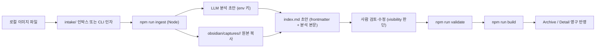

# Phase 6 — Local Ingest And Real LLM Analysis

목표: Intake의 브라우저 데모를 넘어서, 사람이 로컬에서 실행하는 스크립트로 캡처 이미지를 Obsidian vault에 **영구 저장**하고, 실제 LLM으로 **분석 초안**을 생성한다. "브라우저에 비밀 값 금지"와 "사람이 실행" 원칙은 그대로 유지한다.

참조 결정: `D-01`, `D-05`, `D-06`, `D-08`, `D-10`, `D-11`, `D-14`, `D-16`, `D-17`

> 상태: **구현됨**(`scripts/ingest.ts`, `npm run ingest`). 아래 **확정된 결정**은 이 프로젝트가 사외 프로젝트라는 전제로 확정했다. 사내 적용 시 제공자/키/전송 정책은 재확인이 필요하다.

## 사용법

```bash
# 키 설정 (셸 환경변수 또는 .env — .env는 .gitignore 대상)
export OPENAI_API_KEY=sk-...
# 선택: export OPENAI_BASE_URL=... / export INGEST_MODEL=gpt-4o-mini

# 스틸 캡처 1건 (LLM 분석)
npm run ingest -- ./shot.png --service "네이버 쇼핑" --source https://shopping.naver.com

# 여러 건 배치 + 촬영일/버전
npm run ingest -- a.png b.jpg --captured-at 2026-09-02 --app-version 5.1

# 파일을 쓰지 않고 생성될 초안만 확인
npm run ingest -- ./shot.png --dry-run
```

실행 후: `index.md`의 `검토 필요` 섹션과 본문을 사람이 검토·보정 → `npm run validate` → `npm run build`.

## 경계 (무엇을 바꾸고 무엇을 유지하나)

- 브라우저 Intake(`src/local-intake.ts`)는 그대로 **미리보기/임시 리뷰**로 남긴다. vault를 쓰지 않고 세션 메모리에만 카드를 만든다. (`D-11`)
- **영구 저장과 LLM 분석은 로컬 Node 스크립트로만** 수행한다. 사람이 터미널/작업창에서 명령으로 실행하며, watcher·CI·자동 배포를 만들지 않는다. (`D-10`, `D-11`)
- LLM API 키는 브라우저에 두지 않는다. 로컬 Node 프로세스가 환경변수에서 읽는다. 키는 로그·리포트·번들에 남기지 않는다. (`D-11`)
- 파생 가능한 값(치수·바이트·포맷·프레임 수·재생 시간·해시)은 여전히 Markdown에 쓰지 않는다. 빌드가 파일에서 파생한다. (`D-01`, authoring-guide)
- LLM 출력은 **결정적이지 않다**. 따라서 산출물은 사람이 검토·수정·커밋하는 **draft**이고, 빌드 결정성 경계 밖에 둔다. 빌드(`build-index.ts`)의 결정성 계약은 변하지 않는다.

## 흐름



## 작업 계획

| 작업 | 계획 | 검증 |
|---|---|---|
| ingest CLI 스캐폴딩 | `scripts/ingest.ts`와 `npm run ingest` 스크립트를 만든다. 입력은 CLI 인자 이미지 경로 또는 `intake/` 인박스 폴더 스캔. 서버 런타임을 만들지 않는다. | `npm run ingest -- <image>` 실행 시 `obsidian/captures/<slug>/`가 생성되고 원본이 복사된다. |
| slug 생성·충돌 처리 | 파일명 기반 slug(영문 소문자·숫자·하이픈)를 만들고, 이미 존재하면 실패로 멈추거나 `--slug`로 명시 요구한다. 조용히 덮어쓰지 않는다. | 같은 slug로 두 번 실행하면 경로와 사유를 출력하고 exit 1. |
| 원본 저장 | 스틸 `PNG/JPG/WebP`, 모션 `GIF/MP4/WebM`만 허용한다. 원본을 그대로 캡처 폴더에 둔다(파생·리사이즈 없음). (`D-06`, `D-07`) | 허용 외 포맷은 거부하고, 저장된 파일이 `asset` 경로와 일치한다. |
| frontmatter 초안 | 템플릿(`obsidian/_templates/capture.md`)을 기준으로 frontmatter를 채운다. 파생 메타 필드(width/height/bytes/format/frameCount/duration/hash)는 넣지 않는다. `capturedAt`·`sourceUrl`·`service`·`appVersion`은 사람 입력 또는 CLI 인자. | `npm run validate`가 통과하고, 파생 메타 필드가 frontmatter에 없다. |
| LLM 분석 초안 | Node에서 이미지 + 고정 프롬프트로 `D-08`의 10개 분석 항목을 생성한다. 결과를 frontmatter 패싯(platform/screenType/uiPatterns/tone/copyTone/tags)과 본문 섹션(Layout/Color/Typography/Interaction 등)으로 나눈다. | 10개 항목이 비어 있지 않다. 각 항목이 authoring-guide 기준을 따른다. |
| 통제 어휘 강제 | LLM이 낸 platform/screenType/uiPattern/tone/copyTone/tag를 `src/shared/vocabulary.ts`에 매핑한다(태그는 `normalizeTag` 동의어 반영). 어휘 밖 값은 안전한 기본값으로 보정하고, 무엇을 어떻게 바꿨는지 `검토 필요` 섹션에 남긴다. | 보정 내역이 `index.md`에 남고 `npm run validate`가 통과한다. |
| 미확정 규칙 | 확신이 낮은 항목은 추정하지 않고 `미확정`/`사용자 확인 필요`와 이유를 쓰도록 프롬프트로 강제한다. 특히 typeface, 정지 캡처의 interaction. | 정지 이미지 입력에서 interaction이 `사용자 확인 필요`로 표기될 수 있다. |
| visibility 게이트 | 기본값 `internal` 하드코딩. LLM은 public 여부를 판단하지 않는다. 사람이 검토 단계에서만 `public`으로 승격한다. (`D-03`) | ingest 직후 항목은 internal이고, public 승격은 사람 편집으로만 일어난다. |
| 검토 게이트 | 스크립트는 자동 커밋하지 않는다. 파일만 생성하고, 보정이 있으면 `검토 필요` 섹션으로 표시한다. 사람이 검토·커밋한 뒤에만 build/web에 반영된다. | 스크립트가 git을 건드리지 않고, 미검토 초안이 자동으로 public 빌드에 들어가지 않는다. |
| wiki 로그 | ingest 성공 시 `obsidian/wiki/log.md` 맨 위에 `## [YYYY-MM-DD] ingest | <title>` 항목을 삽입한다(최신 우선). 관련 wiki 페이지 갱신은 사람이 별도 요청한다. (`D-16`, `D-17`) | 로그 형식이 `npm run validate`를 통과한다. |
| 모션 처리 | 현재 GIF/MP4/WebM은 LLM 이미지 분석을 **건너뛰고** 플레이스홀더 초안(모든 관찰을 `사용자 확인 필요`)을 만든다. 사람이 프레임을 보고 채운다. 프레임 추출 자동화는 후속. | 모션 입력에서 파일이 생성되고 interaction이 사람 작성 대기로 표기된다. |
| 배치·실패 처리 | 여러 이미지를 순차 처리하고, 성공/실패 개수와 사유를 마지막에 출력한다. 하나가 실패해도 나머지는 계속하고 종료 코드로 실패를 알린다. | 대량 입력에서 실패가 조용히 넘어가지 않는다. |

## LLM 분석 설계 원칙

- **근거 우선**: 각 분석 항목은 이미지에서 관찰 가능한 근거만 쓴다. 보이지 않는 동작·글꼴·버전을 추정하지 않는다.
- **스키마·어휘 계약**: 출력은 `src/shared/schema.ts`와 `src/shared/vocabulary.ts` 계약을 따른다. 계약 밖 값은 통과가 아니라 표시·실패다.
- **비결정성 격리**: LLM 결과는 draft이며 사람이 커밋한다. 빌드는 커밋된 Markdown만 읽으므로 결정성(`D-01`, Phase 2)이 유지된다.
- **보안 경계**: 키는 env로만. 사내 캡처를 외부 API로 보낼 수 있는지는 조직 승인 사항(아래 확인 필요). public/internal 경계는 사람이 판단한다.
- **자동화 금지 유지**: ingest는 사람이 실행한다. 파일 변경 감지 자동 ingest를 만들지 않는다. (`D-10`, `D-11`)

## 확정된 결정 (사외 프로젝트 전제)

| 항목 | 결정 | 근거/재확인 조건 |
|---|---|---|
| LLM 제공자·모델 | OpenAI 호환 Chat Completions vision. 기본 모델 `gpt-4o-mini`, `INGEST_MODEL`로 교체. `OPENAI_BASE_URL`로 엔드포인트(사내 게이트웨이 포함) 교체 가능. SDK 없이 `fetch`로 호출해 의존성 추가 없음. | 사내 적용 시 승인 제공자/모델로 env만 바꾸면 됨. |
| 사내 이미지 외부 전송 | 허용. | 사용자가 "사외 프로젝트라 상관없음"으로 확정. 사내 캡처 적용 시 재확인 필요. |
| API 키 관리 | 셸 환경변수 우선, 편의를 위해 로컬 `.env`도 지원(`.gitignore` 대상). 키는 로그·번들에 남기지 않는다. | 사내 비밀 관리 도구가 있으면 env로 주입만 하면 됨. |
| 초안 커밋 정책 | 스크립트는 커밋하지 않는다. 파일만 만들고 사람이 검토 후 커밋. 보정 발생 시 `검토 필요` 섹션으로 표시(스키마 오염 없이). | — |
| 모션 프레임 샘플링 | MVP 보류. 모션은 LLM 분석을 건너뛰고 플레이스홀더 초안 생성. | `ffmpeg`/`ffprobe` 프레임 추출은 후속 작업으로 분리. |
| 비용·레이트 한도 | 순차 처리 + 실패 개수/사유 출력. 하드 레이트 가드는 두지 않음. | 대량 배치가 필요해지면 동시성·비용 사전 출력 추가. |

## 통과 기준

- 브라우저는 여전히 이미지 분석 API 키를 갖지 않는다. LLM 호출은 로컬 Node에서만 일어난다.
- ingest는 사람이 명령으로 실행하며, 자동 watcher·CI·자동 배포를 만들지 않는다.
- 산출물은 스키마·통제 어휘 계약을 따르고, 계약 밖 값과 미확정 항목을 조용히 통과시키지 않는다.
- 파생 가능한 자산 메타는 Markdown에 쓰지 않고 빌드가 파일에서 파생한다.
- LLM 초안은 사람이 검토·확정한 뒤에만 build/web에 반영되고, 빌드 결정성 계약은 그대로 유지된다.
