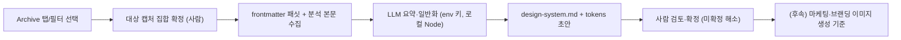

# Phase 7 — Design System Generation

목표: Archive의 특정 탭/필터로 좁힌 캡처 분석 결과를 근거로, LLM이 **디자인 시스템 문서(`design-system.md`)와 토큰 초안**을 생성한다. 이렇게 생성된 산출물은 나중에 **마케팅·브랜딩 이미지 생성**의 기준으로 쓴다.

참조 결정: `D-01`, `D-08`, `D-10`, `D-11`, `D-16`, `D-17` / 연계: [Phase 6 로컬 ingest](phase-6-intake-ingest.md)

> 상태: **구현됨**(`src/views/design-system.ts`, `scripts/design-system.ts`, `npm run design-system`). UI에는 "아직 준비중입니다." 문구를 유지하되, 현재 Archive 조건의 대상 캡처를 컬러·폰트/타이포·마진/간격·컴포넌트 형태 중심으로 요약하고 로컬 생성 명령을 함께 보여 준다.

## 사용법

```bash
# 키 설정 (셸 환경변수 또는 .env)
export OPENAI_API_KEY=sk-...
# 선택: export OPENAI_BASE_URL=... / export DESIGN_SYSTEM_MODEL=gpt-4o-mini

# Archive/Design System 탭에서 제안된 slug 목록으로 생성
npm run design-system -- --name filters --slugs naver-shopping-gallery airbnb-mobile-search

# LLM 없이 구조만 검증하는 deterministic draft
npm run design-system -- --name filters --slugs naver-shopping-gallery airbnb-mobile-search --no-llm

# 파일을 쓰지 않고 출력만 확인
npm run design-system -- --name filters --slugs naver-shopping-gallery airbnb-mobile-search --dry-run
```

생성 위치: `obsidian/design-systems/<name>/design-system.md`, `sources.md`, `tokens.json`.

## 개념

- **입력**: Archive에서 사람이 좁힌 캡처 집합(예: 특정 탭, `platform=web` + `tags=filters` 같은 필터 결과). 각 캡처의 frontmatter 패싯과 분석 본문(Layout/Color/Typography/Interaction)이 근거가 된다.
- **처리**: 근거를 모아 LLM이 색·타이포·간격·컴포넌트 원칙 등을 **요약·일반화**해 디자인 시스템 초안을 만든다. 관찰에 없는 값은 지어내지 않고 `미확정`으로 남긴다.
- **출력**: 디자인 시스템 문서 + 토큰 초안. 사람이 검토·확정한다.

## 명명 규칙 (중요)

- 생성물은 프로젝트/시스템의 `design.md`와 **혼동되지 않도록 다른 이름**을 쓴다.
- 저장 위치: `obsidian/design-systems/<name>/` (캡처 vault와 분리).
  - `design-system.md` — 사람이 읽는 디자인 시스템 문서(원칙·근거·미확정 목록).
  - `tokens.json`(또는 `tokens.md`) — 색/타이포/간격 토큰 초안.
  - `sources.md` — 어떤 캡처 집합에서 파생했는지 근거 링크(`[[slug]]`).
- 시스템의 `design.md`(있다면)는 이 스크립트가 절대 건드리지 않는다.

## 흐름



## 작업 계획

| 작업 | 계획 | 검증 |
|---|---|---|
| 대상 선택 UI | `Design System` 탭에서 Archive 필터/탭 결과를 대상 집합으로 넘겨받는다. 최소 캡처 수와 컬러·폰트/타이포·마진/간격·컴포넌트 형태 근거를 보여 준다. | 선택한 집합의 캡처 수와 비주얼 요소별 근거가 화면에 표시된다. |
| 생성 스크립트 | Phase 6와 같은 원칙의 로컬 Node 스크립트(`npm run design-system`). 대상 slug 목록을 입력받아 근거를 모으고 LLM 호출. 브라우저는 키를 갖지 않는다. (`D-10`, `D-11`) | 사람이 명령으로 실행하고, `obsidian/design-systems/<name>/`가 생성된다. |
| 근거 수집 | 대상 캡처의 frontmatter 패싯과 분석 본문만 근거로 쓴다. 파생 자산 메타는 넣지 않는다. (`D-01`) | 산출물의 각 주장에 근거 캡처가 연결된다. |
| LLM 요약·일반화 | 색/타이포/간격/컴포넌트 원칙을 통제 어휘·근거 우선 규칙으로 초안화. 관찰 밖 값은 `미확정`으로 표기. (`D-08`) | 근거 없는 토큰 값이 조용히 들어가지 않는다. |
| 명명·분리 | 산출물을 `design-system.md` 등 별도 이름·별도 폴더에 저장. 시스템 `design.md`는 건드리지 않는다. | 생성물이 캡처 vault와 시스템 문서를 오염시키지 않는다. |
| 검토 게이트 | 스크립트는 커밋하지 않는다. 사람이 미확정 항목을 해소하고 확정한다. | 미검토 초안이 자동으로 기준으로 승격되지 않는다. |
| 로그 | 생성 시 `obsidian/wiki/log.md`에 `## [YYYY-MM-DD] ingest | design-system <name>` 형태로 남긴다(형식은 `validate` 통과). | 로그 형식 검증 통과. |

## 후속 (별도 Phase)

- 확정된 디자인 시스템을 기준으로 **마케팅·브랜딩용 이미지 생성**. 토큰·원칙을 이미지 생성 프롬프트/제약으로 변환한다. 상세 설계는 착수 시점에 별도 문서로 분리한다.

## 확정된 결정

| 항목 | 결정 |
|---|---|
| 토큰 산출 형식 | `tokens.json`을 표준 산출물로 둔다. 사람이 읽는 설명은 `design-system.md`에 함께 둔다. |
| 대상 집합 최소 조건 | 스크립트는 최소 1개부터 허용한다. 신뢰도는 사람이 검토하며, UI에서 대상 개수와 분포를 보여 준다. |
| 생성 트리거 | 브라우저는 대상 요약과 CLI 명령만 제공한다. 실제 LLM 호출과 파일 쓰기는 로컬 CLI에서만 한다. |
| 모델/키 | OpenAI 호환 Chat Completions. `DESIGN_SYSTEM_MODEL` → `INGEST_MODEL` → `gpt-4o-mini` 순으로 모델 결정. 키는 env/`.env`. |

## 후속 확인 필요

| 항목 | 확인이 필요한 이유 |
|---|---|
| 마케팅 이미지 생성기 | 이미지 생성 모델·저작권·브랜드 가이드 준수 범위(후속 Phase에서 확정). |

## 통과 기준

- `Design System` 탭이 존재하고, "아직 준비중입니다." 문구와 비주얼 요소별 대상 캡처 요약·CLI 명령이 보인다. (현재 충족)
- 생성물은 시스템 `design.md`와 이름·위치가 분리되어 혼동되지 않는다.
- 생성은 사람이 로컬에서 실행하며, LLM 키는 브라우저에 없다.
- 산출물의 토큰·원칙은 근거 캡처에 연결되고, 관찰 밖 값은 `미확정`으로 남는다.
- 사람이 검토·확정한 뒤에만 후속(마케팅·브랜딩 이미지)의 기준으로 쓰인다.
