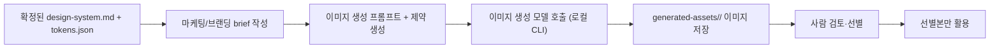

# Phase 8 — Marketing And Branding Image Generation

목표: 확정된 디자인 시스템(`obsidian/design-systems/<name>/design-system.md`, `tokens.json`)을 기준으로, 나중에 **마케팅용·브랜딩용 이미지**를 생성할 수 있는 구조를 설계한다.

참조 결정: `D-01`, `D-08`, `D-10`, `D-11` / 연계: [Phase 7 Design System Generation](phase-7-design-system.md)

> 상태: **계획만. 구현하지 않는다.** 이미지 생성 모델, 저작권/브랜드 정책, 산출물 저장 정책을 확정한 뒤 별도 착수한다.

## 경계

- 이 Phase는 **캡처 분석 → 디자인 시스템 생성** 이후의 후속 단계다.
- 입력은 사람이 검토·확정한 `design-system.md`와 `tokens.json`만 사용한다.
- 브라우저는 이미지 생성 API 키를 갖지 않는다. 실제 생성은 Phase 6/7처럼 사람이 실행하는 로컬 Node 스크립트로만 수행한다.
- 생성 이미지는 원본 캡처나 시스템 `design.md`를 덮어쓰지 않는다.
- 브랜드 로고, 슬로건, 상표, 인물, 저작권 소재는 사람이 승인한 자산만 사용한다.

## 예상 흐름



## 산출물 구조 초안

```text
obsidian/design-systems/<name>/
  design-system.md
  tokens.json
  sources.md

generated-assets/
  <campaign-name>/
    brief.md
    prompt.md
    image-001.png
    image-002.png
    manifest.json
```

## 작업 계획

| 작업 | 계획 | 검증 |
|---|---|---|
| 캠페인 brief 정의 | 목적, 채널, 화면 비율, 톤, 금지 요소, 참고 디자인 시스템을 사람이 명시한다. | `brief.md`만으로 생성 의도를 이해할 수 있다. |
| 디자인 시스템 로딩 | 확정된 `design-system.md`와 `tokens.json`을 읽어 색/타입/컴포넌트/이미지 가이드라인을 프롬프트 제약으로 변환한다. | 프롬프트가 원천 디자인 시스템 파일을 명시적으로 참조한다. |
| 프롬프트 생성 | 이미지 모델별 prompt/negative prompt/size/style 값을 만든다. 관찰에 없는 브랜드 요소는 넣지 않는다. | `prompt.md`에 근거와 금지 사항이 남는다. |
| 이미지 생성 CLI | `npm run generate-marketing-image`(가칭)로 로컬에서 실행한다. 브라우저 키·watcher·CI 자동 생성은 만들지 않는다. | env 키가 없으면 실패하고, 생성물은 지정 폴더에만 저장된다. |
| manifest 기록 | 모델명, 생성 시각, 입력 design-system, brief, 파일명, seed/옵션을 `manifest.json`에 기록한다. | 같은 산출물을 추적·폐기할 수 있다. |
| 사람 검토 게이트 | 생성 이미지는 자동 공개/배포하지 않는다. 사람이 선별한 파일만 사용한다. | public 번들에 자동 포함되지 않는다. |

## 확인 필요

| 항목 | 확인이 필요한 이유 |
|---|---|
| 이미지 생성 모델 | OpenAI Images, Figma, 기타 모델 중 어느 것을 쓸지에 따라 API와 산출물 포맷이 달라진다. |
| 저작권·브랜드 정책 | 외부 서비스 UI에서 뽑은 디자인 시스템을 마케팅 이미지에 어느 수준까지 활용할 수 있는지 확인 필요. |
| 저장 위치 | `generated-assets/`를 git에 포함할지, 로컬 산출물로만 둘지 결정 필요. |
| 사용 채널 | 웹 배너, SNS, 앱스토어, 랜딩 페이지 등 채널별 비율/해상도/카피 규칙이 다르다. |
| 사람 승인 단계 | 어떤 기준으로 이미지를 채택/폐기할지 체크리스트가 필요하다. |

## 통과 기준

- 구현 전까지는 코드·라우트·스크립트를 추가하지 않는다.
- 디자인 시스템이 확정되지 않은 상태에서는 이미지를 생성하지 않는다.
- 생성 모델과 저작권/브랜드 정책이 확정된 뒤에만 구현을 시작한다.
- 생성 이미지는 자동 배포되지 않고, 사람이 선별한 산출물만 사용한다.
